# Employee Management System

## 1. Overview

Employee Management System is a RESTful backend application built using Spring Boot. It provides APIs to manage employees and departments with validation, exception handling, pagination, sorting, and search functionality.

The project follows a layered architecture using Controller, Service, Repository, and Entity layers to ensure clean, maintainable, and scalable code.

---

## 2. Technologies

- Java 17
- Spring Boot
- Spring Data JPA
- Hibernate
- MySQL
- Maven
- Lombok
- ModelMapper
- Bean Validation
- Postman

---

## 3. Features

### Department Management

- Create Department
- Get All Departments
- Get Department By Id
- Update Department
- Delete Department

### Employee Management

- Create Employee
- Get All Employees
- Get Employee By Id
- Update Employee
- Delete Employee
- Search Employee By First Name
- Pagination
- Sorting

### Additional Features

- DTO Pattern
- Layered Architecture
- One-to-Many Relationship
- Global Exception Handling
- Custom Exception Handling
- Request Validation

---

## 4. Project Structure

```
src/main/java
│
├── Config
├── Controllers
├── Dto
├── Entity
├── Exception
├── Repository
├── Service
└── EmployeeManagementApplication
```

---

## 5. Application Workflow

### Control Flow


### Entity Relationship

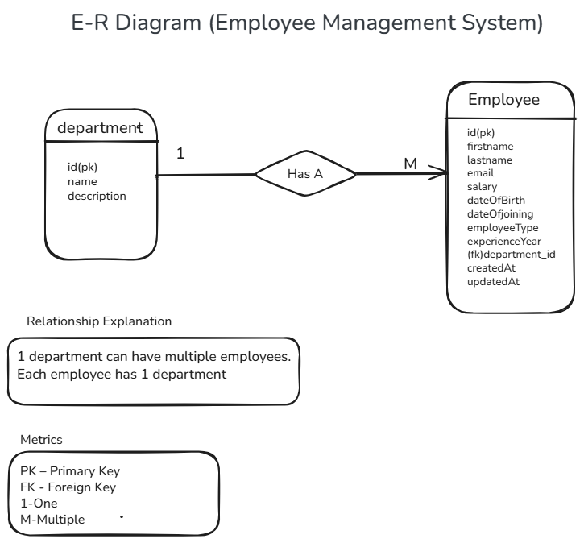

### Project Structure

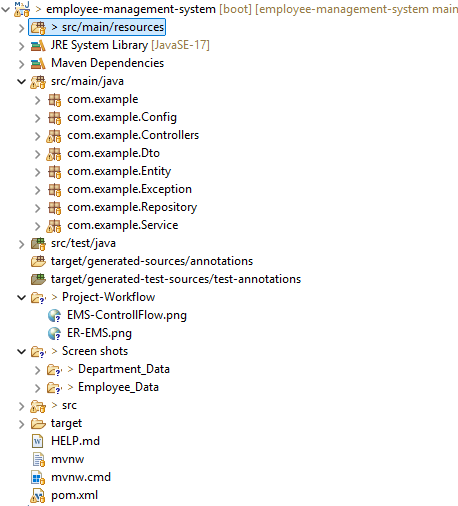

---
## 6. REST APIs

```text
http://localhost:8080/api
```
### 6.1 Department API Endpoints

| Method | Endpoint | Description |
|--------|----------|-------------|
| POST | `/api/departments` | Create a new department |
| GET | `/api/departments` | Get all departments |
| GET | `/api/departments/{id}` | Get department by ID |
| PUT | `/api/departments/{id}` | Update department |
| DELETE | `/api/departments/{id}` | Delete department |

---

### 6.2 Employee API Endpoints

| Method | Endpoint | Description |
|--------|----------|-------------|
| POST | `/api/employees` | Create a new employee |
| GET | `/api/employees` | Get all employees |
| GET | `/api/employees/{id}` | Get employee by ID |
| PUT | `/api/employees/{id}` | Update employee |
| DELETE | `/api/employees/{id}` | Delete employee |
| GET | `/api/employees/search?firstName={name}` | Search employee by first name |
| GET | `/api/employees?page=0&size=5` | Get employees with pagination |
| GET | `/api/employees?sortBy=firstName&direction=asc` | Get sorted employees |

---

## 7. API Screenshots

### Department APIs

#### Create Department


#### Department Created

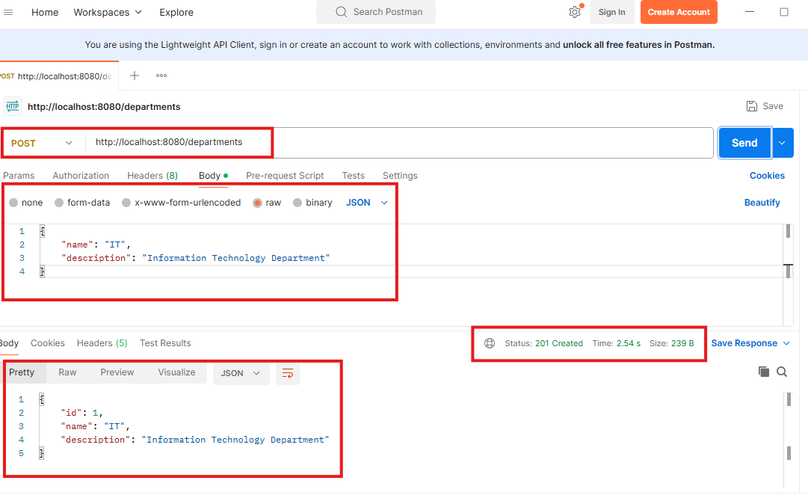

#### Get All Departments

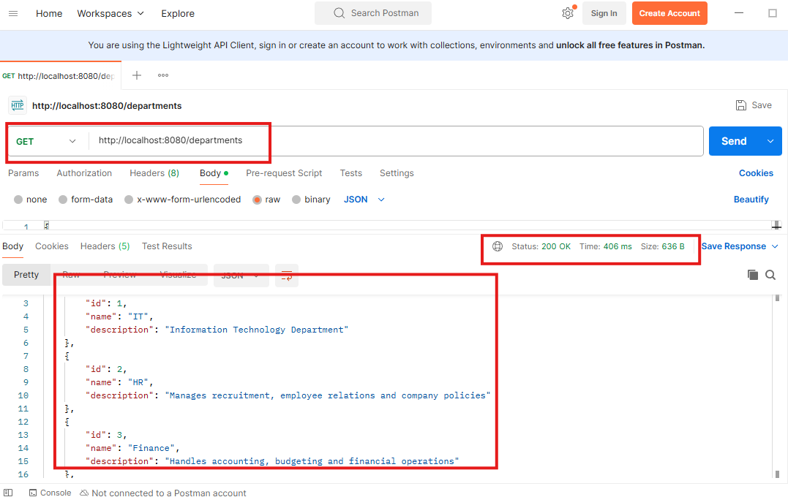

#### Get Department By Id


#### Update Department

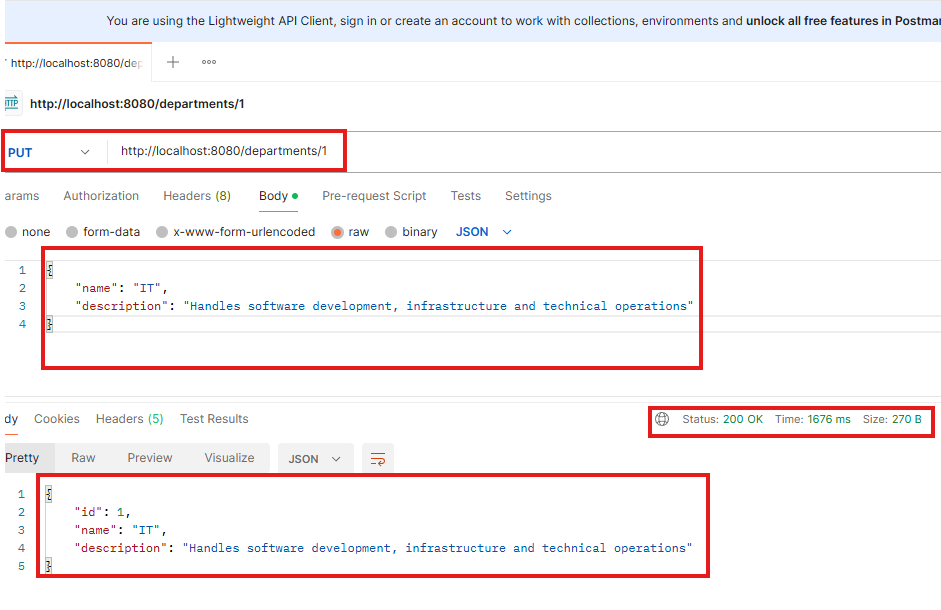

#### Delete Department


---

### Employee APIs

#### Create Employee

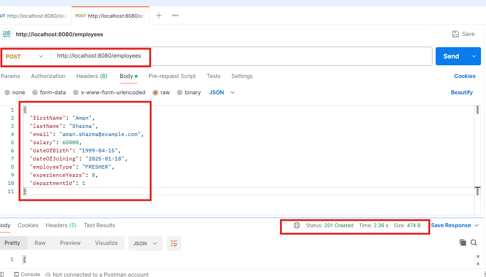

#### Employee Created

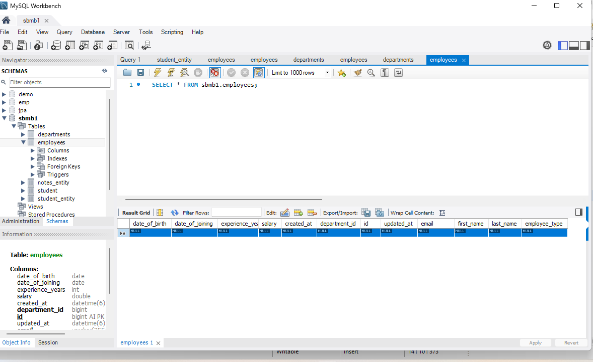

#### Get All Employees


#### Get Employee By Id

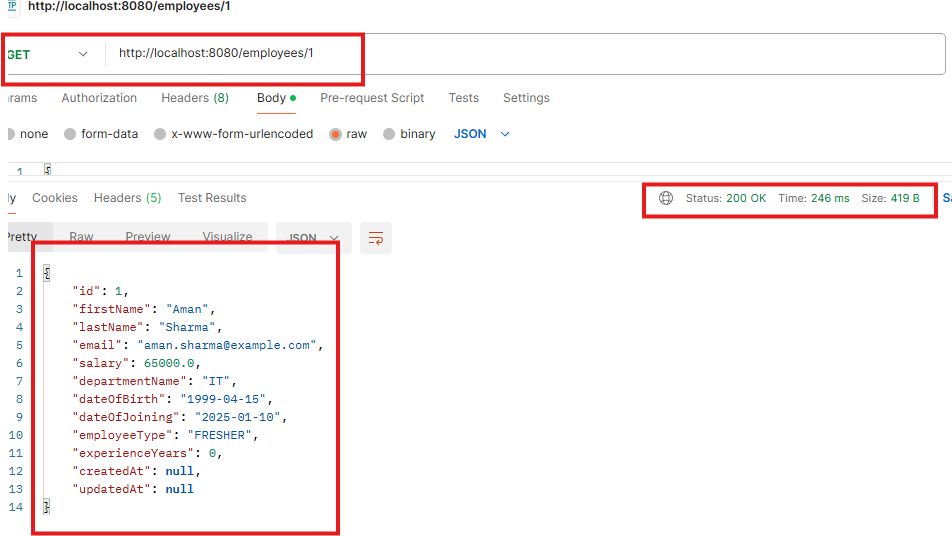

#### Search Employee By First Name


#### Update Employee

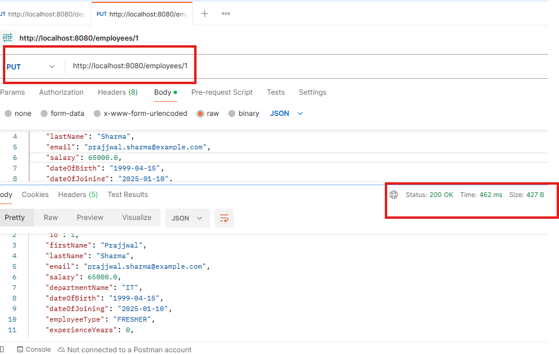

#### Employee Updated

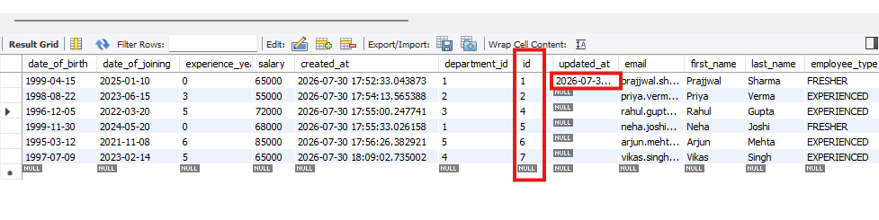

#### Delete Employee


#### Pagination

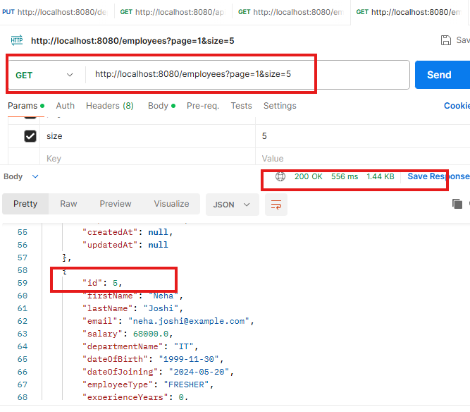

#### Validation

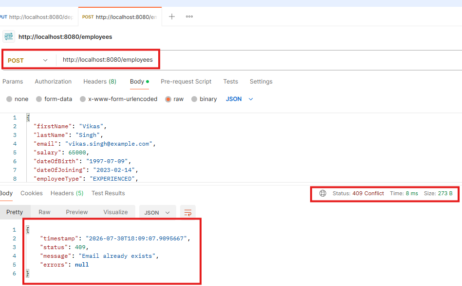

#### Employee Not Found

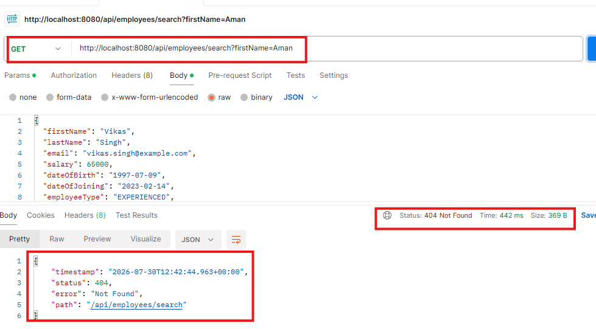

---

## 8. Configuration

| Property | Value |
|----------|-------|
| Java Version | 17 |
| Database | MySQL |

---

## 9. Running the Project

1. Clone the repository

```bash
git clone https://github.com/your-username/employee-management-system.git
```

2. Configure MySQL in `application.properties`.

3. Create the database in MySQL.

```sql
CREATE DATABASE employee_management;
```

4. Run the application.

```bash
mvn spring-boot:run
```

## 10. Future Improvements

- Spring Security
- JWT Authentication
- Role-Based Access Control (RBAC)
- Swagger / OpenAPI Documentation
- Docker Support
- Unit Testing
- Logging

---

## 11. Author

**Heera Chourey**

Java Backend Developer
